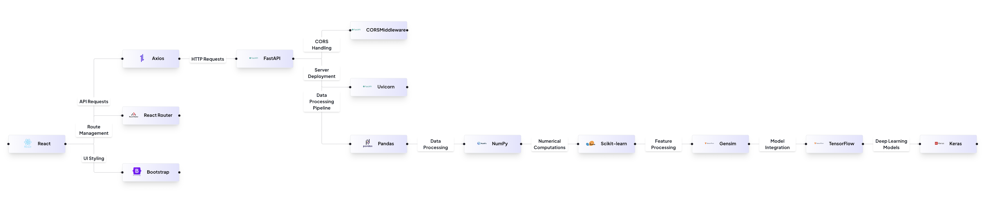

# Movie Recommendation System

## Table of Contents
1. [Executive Summary](#executive-summary)
2. [Feature Overview](#feature-overview)
3. [Architecture Diagram](#architecture-diagram)
4. [Technologies Used](#technologies-used)
5. [Installation & Setup](#installation--setup)
6. [Usage](#usage)
7. [Project Structure](#project-structure)
8. [Contributing](#contributing)
9. [License](#license)

---

## Executive Summary

### Increased Operational Efficiency and Cost Savings
- The system leverages **machine learning techniques** like Word2Vec and TruncatedSVD to automate personalized movie recommendations.
- Reduces **manual effort** for curating movie suggestions, improving operational efficiency.
- Handles **large-scale users and movies** without additional human intervention, leading to cost savings.

### Improved Scalability and Performance
- Modular design with clear separation between **data preprocessing, recommendation models, backend API, and frontend application**.
- Uses **FastAPI** for efficient API performance and **React** for a dynamic frontend, ensuring seamless scalability and responsiveness.

### Enhanced User Experience
- Provides **personalized recommendations** based on user preferences and historical interactions.
- Responsive and intuitive **React-based UI** enables smooth user interaction.

### Competitive Advantage
- Hybrid recommendation approach combining **content-based filtering** and **collaborative filtering**.
- Integrated backend API and frontend create a **cohesive user experience**.

---

## Feature Overview

### **Movie Recommendation System**
A recommendation system that suggests movies based on user preferences and historical data using machine learning models.

### **Movie Data Processing and Feature Engineering**
- Reads and processes **CSV files** containing movie details, credits, and user ratings.
- Extracts features such as **title, overview, genres, cast, crew, and keywords**.
- Cleans and transforms data for **machine learning models**.

### **Content-Based Filtering**
- Trains a **Word2Vec model** on movie metadata.
- Generates vector representations of movies based on **content similarity**.

### **Collaborative Filtering**
- Trains a **TruncatedSVD model** on user ratings.
- Identifies latent factors representing **user preferences** and movie characteristics.

### **Hybrid Recommendation Engine**
- Combines **content-based filtering** and **collaborative filtering** for improved accuracy.
- Generates personalized and diverse movie suggestions.

### **Frontend Application**
- **React-based UI** for seamless interaction.
- Users can **search movies, view recommendations, and provide feedback**.
- Communicates with backend API for recommendations.

---

## Architecture Diagram

The architecture of the system is depicted in the following diagram:



---

## Technologies Used

### **Backend (FastAPI & Machine Learning Models)**
- **FastAPI** – High-performance web framework for APIs.
- **Uvicorn** – ASGI server for running FastAPI applications.
- **pandas** – Data processing and analysis.
- **numpy** – Numerical computation.
- **scikit-learn** – Machine learning model training.
- **Gensim** – Word2Vec implementation.
- **TensorFlow & Keras** – Deep learning models.

### **Frontend (React & Related Libraries)**
- **React** – Frontend framework for UI development.
- **react-router-dom** – Routing for React applications.
- **axios** – HTTP client for API calls.
- **Bootstrap** – CSS framework for styling.
- **jest-dom** – Testing utility for React components.
- **web-vitals** – Web performance monitoring.

---

## Installation & Setup

### **Backend Setup (FastAPI)**

1. Clone the repository:
    ```sh
    git clone https://github.com/yourusername/movie-recommendation-system.git
    cd movie-recommendation-system/MovieMateService
    ```

2. Create a virtual environment and activate it:
    ```sh
    python -m venv venv
    source venv/bin/activate  # On Windows use `venv\Scripts\activate`
    ```

3. Install dependencies:
    ```sh
    pip install -r requirements.txt
    ```

4. Run the FastAPI server:
    ```sh
    uvicorn app.main:app --reload
    ```

### **Frontend Setup (React)**

1. Navigate to the frontend directory:
    ```sh
    cd ../MovieMateFrontend/movie-mate-frontend
    ```

2. Install dependencies:
    ```sh
    npm install
    ```

3. Start the React development server:
    ```sh
    npm start
    ```

---

## Usage

### **Access the API**
- Open **http://localhost:8000** for FastAPI interactive API documentation.

### **Use the Frontend**
- Open **http://localhost:3000/** in a browser to interact with the movie recommender UI.

---

## Project Structure
```
movie-recommendation-system/
│── MovieMateService/               # Backend service (FastAPI)
│   ├── app/
│   │   ├── main.py                 # API entry point
│   │   ├── recommender.py           # Recommendation logic
│   │   ├── data_preprocessing.py    # Data processing utilities
│   │   ├── models.py                # ML models (Word2Vec, TruncatedSVD)
│   │   ├── requirements.txt         # Python dependencies
│   ├── generate_ratings.py          # Simulated user ratings generator
│
│── MovieMateFrontend/              # Frontend service (React)
│   ├── src/
│   │   ├── components/             # React components
│   │   ├── context/                # State management
│   │   ├── services/               # API service handlers
│   │   ├── App.jsx                 # Root component
│   │   ├── index.jsx               # React entry point
│   │   ├── package.json            # Node dependencies
│
│── architecture.png                # System architecture diagram
│── README.md                       # Project documentation
```

---

## Contributing

We welcome contributions! Follow these steps to contribute:

1. Fork the repository.
2. Create a new branch for your feature.
3. Commit your changes and push to your fork.
4. Open a pull request with a clear description of your changes.

---

## License

This project is licensed under the **MIT License**. See the `LICENSE` file for details.

